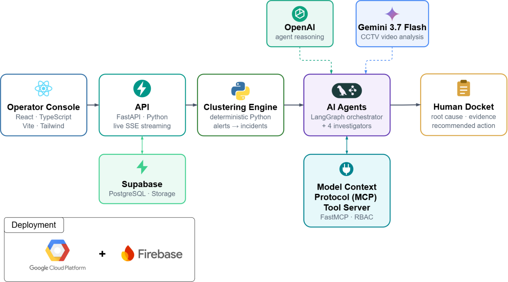

# PSA Tuas Smart Port Operations - Powered by Sherlock AI

---

## Table of Contents

1. [What is Sherlock AI?](#what-is-sherlock-ai)
2. [How Sherlock AI Works](#how-sherlock-ai-works)
3. [Sherlock AI Walkthrough](#sherlock-ai-walkthrough)
4. [Key Decisions Made](#key-decisions-made)
5. [System Architecture Diagram](#system-architecture-diagram)
6. [Tech Stack Used](#tech-stack-used)
7. [Responsible & Transparent AI](#responsible--transparent-ai)
8. [Security](#security)
9. [Future Plans](#future-plans)

---

## What is Sherlock AI?

Sherlock AI is an agentic incident triage workflow for PSA's Tuas Port operations. It clusters raw AGV sensor alerts into incidents, reviews any CCTV footage attached to those incidents, and lets an orchestrator agent decide which specialist investigator agent(s) should examine each one. It then correlates root causes across related incidents and hands every finding to a human, who accepts or rejects the recommended action.

---

## How Sherlock AI Works

1. **Cluster raw alerts into incidents.** Sherlock AI groups raw AGV sensor alerts that describe the same underlying problem, based on their location, timing, and fault type, into a single incident.
2. **Review any CCTV footage.** If an incident has camera footage linked to it, a video analyst agent watches the clip and reports what it sees, independent of what the sensor alerts say.
3. **Decide who investigates.** An orchestrator agent weighs the alert data against the video finding and assigns one or more specialist investigator agents to the incident.
4. **Investigate with real tools.** Each assigned investigator agent gathers evidence using domain specific tools, such as telemetry readings, PLC fault codes, and maintenance history, then proposes a root cause and a recommended action.
5. **Reconcile multiple findings.** When more than one investigator agent examines the same incident, their findings are merged into a single, reconciled result, and any disagreement between them is called out rather than hidden.
6. **Correlate related incidents.** A correlation agent checks whether separately investigated incidents actually share one underlying cause, and links them together when they do.
7. **Hand it to a human.** Every recommendation, along with the evidence behind it, lands in a docket for a human to review. The human can accept or reject the recommended action, and no action is ever taken without that approval.

---

## Sherlock AI Walkthrough

1. **AGV Yard Map**
   
   A real time view of every AGV's position and status across the Tuas yard, so an operator can see at a glance where an incident is happening.

2. **Unified Incident Timeline**
   
   A single timeline showing onsets, incidents, and alerts across the whole terminal, with a detail panel for whichever incident is selected.

3. **Incident Queue**
   
   The incidents Stage 1 clustering has produced from raw alerts, ready to be picked for investigation.

4. **View Real Time - Agent Reasoning**
   
   The live investigation view, streaming the currently active agent's reasoning and MCP tool calls as the pipeline runs.

5. **Completed Analysis**
   
   A finished investigation's docket, showing the root cause, the supporting evidence, and the recommended action.

6. **View Investigation Steps**
   
   The full trajectory the pipeline actually took for one incident: video analysis, orchestrator assignment, investigator findings, and correlation.

7. **CCTV Video Shown**
   
   An incident's linked CCTV clip surfaced in the docket as supporting evidence.

8. **CCTV Video Shown 2**
   
   A second example of CCTV footage used as evidence, for a different incident.

9. **Suggested Actions**
   
   The human in the loop panel, where PSA staff accept or reject the agent's recommended action.

---

## Key Decisions Made

1. **Clustering decides "is this one event," the orchestrator separately decides "who investigates it."** These used to be the same deterministic lookup; splitting them is what lets a single incident get 1 to 3 specialists based on real judgment (alert data plus CCTV footage) instead of a fixed problem-type-to-agent table.

2. **No agent executes anything. A human always has the final call.** Every finding is evidence-backed and lands in a docket; PSA staff accept or reject it. There's no autonomous action path to secure or govern in the first place, because there isn't one.

3. **Each specialist investigator gets its own named LangGraph node, not one shared dispatcher.** A single "investigator" node that reads a `domain` field internally would need less wiring, but every trace would look identical from the outside no matter which specialist actually ran. Four separately-named nodes cost more boilerplate in exchange for real per-agent observability; every Langfuse trace or graph render shows exactly which specialist handled a given incident.

---

## System Architecture Diagram

The full pipeline, top to bottom: `raw_alerts` feeds Stage 1's open clustering, which produces incidents for the Video Analyst Agent to review. The Orchestrator Agent then assigns one to three specialist investigator agents in parallel. Their findings are merged by the Aggregator, linked to related incidents by the Correlation Agent, and finally handed to a human to accept or reject.

---

## Tech Stack Used

| Category | Technology | Purpose |
|---|---|---|
| Orchestration | LangGraph | Orchestrator-Worker Agentic Workflow |
| Agent Tools | Model Context Protocol (MCP) | Unified MCP server exposing 9 read/write tools. |
| Reasoning | OpenAI (gpt-5.6-terra) | Drives the orchestrator, all 4 investigator agents, the aggregator, and the correlation agent. |
| Vision | Gemini (gemini-3.7-flash) | Independent CCTV read before routing, told only the incident's location and nothing else. |
| Data | Supabase | `raw_alerts`, telemetry, `videos`, and `incident_clusters_v2`, backed by live Postgres and object storage. |
| API / Streaming | FastAPI + Server-Sent Events | Streams every node's progress live to the frontend as the investigation runs. |
| Frontend | React + TypeScript | Live investigation view, incident queue, time ribbon, and the human accept/reject docket UI. |
| Observability | Langfuse | Every node, video analysis, orchestrator, each investigator, aggregator, correlation, traced separately. |

---

## Responsible & Transparent AI

Sherlock AI does not act as a black box. Every step an agent takes is shown, not just the final answer, so PSA staff can see how a conclusion was reached rather than being asked to simply trust it.

The live investigation view streams each agent's reasoning and every MCP tool call as it happens, and the "View Investigation Steps" trajectory keeps a full record afterward, from video analysis through to correlation.

A human is always in the loop. Every recommendation lands in a docket with its supporting evidence, and no action is ever executed on Sherlock AI's word alone. PSA staff review the evidence and either accept or reject the suggested action.

---

## Security

Every agent in the pipeline operates under the least privilege it needs, not full access. Each stage runs with a fixed role (investigator agents run as `LANE_OPERATIONS_ENGINEER`, docket submission runs as `SYSTEM_COORDINATOR`), and the MCP server checks that role against a permissions matrix before allowing any tool call. An investigator agent, for example, can never call the tool that submits a docket.

Every tool call, whether permitted or denied, is written to an audit log with the role, the tool, the parameters, the latency, and the outcome.

Sherlock AI also practices data minimization: the human-written diagnosis on a raw alert is never shown to any model. Agents only ever see machine-emitted signal, such as fault codes, timestamps, and locations, and a dedicated check enforces that the diagnosis field can never leak into a prompt.

Today, these roles are fixed per pipeline stage rather than tied to an authenticated PSA staff member. Adding real, login-backed role-based access control, so that different PSA staff roles see and approve different sets of incidents, is planned as future work.

---

## Future Plans

The chat input on the investigation view is currently disabled and marked "Coming Soon." The plan is to open it up so PSA staff can ask follow up questions once a diagnosis has landed, for example asking an investigator agent to check one more asset or explain a specific piece of evidence, without having to rerun the whole investigation.

That interface will ship with guardrails, not as an open ended chatbot. Questions will be scoped to the current incident's own evidence rather than free form prompting, any follow up action will still go through the same tool level RBAC enforcement described above, and the agent will be restricted to answering and citing evidence rather than taking or recommending new actions outside its investigator role. Input length limits and rate limiting will also be enforced to reduce the risk of prompt injection and misuse.
