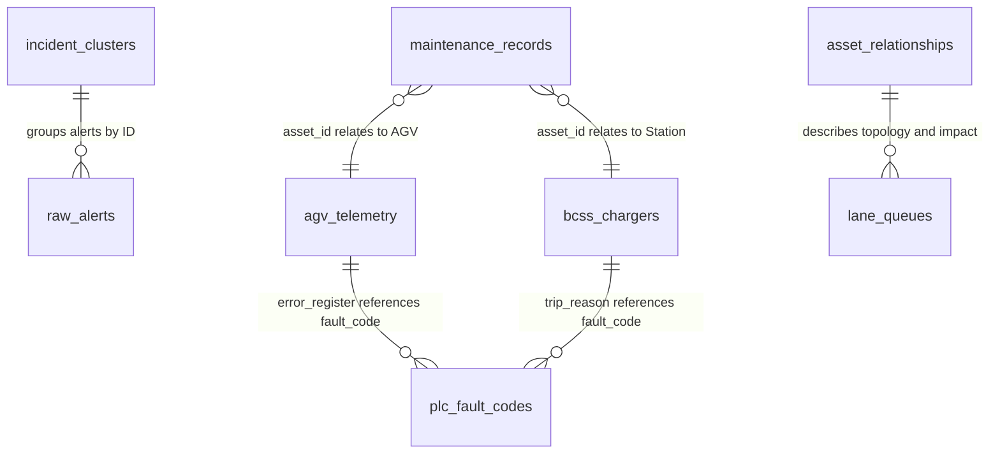

# PSA Port Operations Database Schema Documentation

This document outlines the PostgreSQL / Supabase database schema used for PSA automated port terminal operations, incident investigation agents, telemetry tracking, and asset management.

---

## 1. Schema Overview & Entity Relationship

---

## 2. Table Specifications

### 2.1 `raw_alerts`
Stores real-time alerts emitted by terminal IoT sensors, AGVs, charging stations, and dispatch monitors.

| Column | Type | Constraints | Description |
| :--- | :--- | :--- | :--- |
| `id` | `TEXT` | `PRIMARY KEY` | Unique alert identifier (e.g., `ALT-001`) |
| `timestamp` | `TIMESTAMPTZ` | `NOT NULL` | Timestamp when the alert occurred |
| `source` | `TEXT` | `NOT NULL` | Emitting device or subsystem (e.g., `AGV-104`, `BCSS-02`, `LANE_7_ENTRY_DETECTOR`) |
| `type` | `TEXT` | `NOT NULL` | Category/code of alert (e.g., `TWISTLOCK_TIMEOUT`, `BREAKER_TRIPPED`) |
| `location` | `TEXT` | `NOT NULL` | Physical terminal location or sector (e.g., `Lane_7`, `Station_BCSS_02`, `Sector_A`) |
| `severity` | `TEXT` | `NOT NULL` | Severity level (`CRITICAL`, `HIGH`, `MEDIUM`, `LOW`, `INFO`) |
| `message` | `TEXT` | `NOT NULL` | Human-readable alert summary |

---

### 2.2 `incident_clusters`
Aggregates correlated raw alerts into identified operational incidents assigned to specific agent workflows.

| Column | Type | Constraints | Description |
| :--- | :--- | :--- | :--- |
| `cluster_id` | `TEXT` | `PRIMARY KEY` | Unique incident identifier (e.g., `CLUSTER-A`) |
| `name` | `TEXT` | `NOT NULL` | Title of the incident cluster (e.g., `Lane 7 Bottleneck`) |
| `primary_location` | `TEXT` | `NOT NULL` | Center/focus area of incident (e.g., `Lane_7`, `Sector_A`) |
| `assigned_agent` | `TEXT` | `NOT NULL` | Assigned investigator agent (e.g., `Agent_1_LaneInvestigator`) |
| `raw_alert_ids` | `JSONB` | `NOT NULL` | Array of alert IDs belonging to cluster (e.g., `["ALT-001", "ALT-002", ...]`) |

---

### 2.3 `lane_queues`
Monitors traffic flow, blockage, and vehicle queues across transfer lanes.

| Column | Type | Constraints | Description |
| :--- | :--- | :--- | :--- |
| `lane_id` | `TEXT` | `PRIMARY KEY` | Identifier for the transfer lane (e.g., `Lane_7`, `Lane_4`) |
| `lead_agv_id` | `TEXT` | `NOT NULL` | AGV currently at the front of the queue |
| `blocked_vehicles` | `JSONB` | `NOT NULL` | JSON Array of vehicle IDs currently queued or stopped |
| `status` | `TEXT` | `NOT NULL` | Lane flow status (`BLOCKED`, `SLOWED`, `FLOWING`) |
| `headway_distance_m` | `NUMERIC` | `NOT NULL` | Minimum distance (in meters) between vehicles in lane |

---

### 2.4 `agv_telemetry`
Captures real-time status and sensor metrics from Automated Guided Vehicles (AGVs).

| Column | Type | Constraints | Description |
| :--- | :--- | :--- | :--- |
| `agv_id` | `TEXT` | `PRIMARY KEY` | AGV asset identifier (e.g., `AGV-104`) |
| `speed_mps` | `NUMERIC` | `NOT NULL` | Vehicle speed in meters per second |
| `twistlock_sensor` | `TEXT` | `NOT NULL` | Container twistlock physical state (`ENGAGED`, `RELEASED`) |
| `twistlock_command` | `TEXT` | `NOT NULL` | Active actuator command (`RELEASE`, `ENGAGE`, `NONE`) |
| `hydraulic_pressure_bar` | `NUMERIC` | `NOT NULL` | Hydraulic line pressure (nominal: ~150-200 bar, limit: 275 bar) |
| `error_register` | `TEXT` | `NOT NULL` | Active PLC error code or `OK` |
| `battery_soc_percent` | `NUMERIC` | `NOT NULL` | State of charge percentage (0 - 100%) |
| `motor_temp_c` | `NUMERIC` | `NOT NULL` | Drive motor temperature in degrees Celsius |

---

### 2.5 `bcss_chargers`
Monitors Battery Charging & Swapping Stations (BCSS) health, electrical grid metrics, and breaker states.

| Column | Type | Constraints | Description |
| :--- | :--- | :--- | :--- |
| `station_id` | `TEXT` | `PRIMARY KEY` | BCSS station identifier (e.g., `BCSS-01`, `BCSS-02`) |
| `breaker_state` | `TEXT` | `NOT NULL` | Electrical breaker status (`NOMINAL`, `TRIPPED`, `FAULT`, `IDLE`) |
| `bus_temperature_c` | `NUMERIC` | `NOT NULL` | Main DC busbar temperature in Celsius (trip threshold: 80.0°C) |
| `voltage_v` | `NUMERIC` | `NOT NULL` | Bus voltage in Volts (nominal: 480V) |
| `current_a` | `NUMERIC` | `NOT NULL` | Charging current in Amperes |
| `trip_reason` | `TEXT` | `NULLABLE` | Fault/cutoff reason (e.g., `OVERTEMP_THERMAL_CUTOFF`, `ERR_INSULATION_LEAKAGE`) |

---

### 2.6 `asset_relationships`
Defines physical and logistical topology dependencies and downstream impact across terminal infrastructure.

| Column | Type | Constraints | Description |
| :--- | :--- | :--- | :--- |
| `asset_id` | `TEXT` | `PRIMARY KEY` | Asset identifier (e.g., `Lane_7`, `BCSS-02`, `QC-03`) |
| `asset_type` | `TEXT` | `NOT NULL` | Asset category (`TRANSFER_LANE`, `FEEDER_LANE`, `CHARGING_STATION`, `QUAY_CRANE`) |
| `upstream_dependencies` | `JSONB` | `NOT NULL` | Array of upstream feeder blocks/substations |
| `downstream_impact` | `JSONB` | `NOT NULL` | Array of affected berths, cranes, or vehicle fleets |
| `operational_impact_summary` | `TEXT` | `NOT NULL` | Operational consequence description if asset fails |

---

### 2.7 `plc_fault_codes`
Dictionary and diagnostic lookup table for PLC error codes and recommended remedial actions.

| Column | Type | Constraints | Description |
| :--- | :--- | :--- | :--- |
| `fault_code` | `TEXT` | `PRIMARY KEY` | Error string identifier (e.g., `ERR_TWISTLOCK_TIMEOUT`) |
| `hex_code` | `TEXT` | `NOT NULL` | Hexadecimal diagnostic register code (e.g., `0x7E1`) |
| `device_type` | `TEXT` | `NOT NULL` | Target hardware component (`AGV_ACTUATOR`, `BCSS_STATION`, `AGV_NAV_SENSOR`, etc.) |
| `description` | `TEXT` | `NOT NULL` | Technical fault explanation |
| `possible_causes` | `JSONB` | `NOT NULL` | JSON Array of potential root causes |
| `recommended_action` | `TEXT` | `NOT NULL` | Prescribed recovery procedure or SOP |

---

### 2.8 `maintenance_records`
Historical log of inspections, repairs, calibrations, and component replacements.

| Column | Type | Constraints | Description |
| :--- | :--- | :--- | :--- |
| `record_id` | `TEXT` | `PRIMARY KEY` | Unique log entry ID (e.g., `REC-8821`) |
| `asset_id` | `TEXT` | `NOT NULL` | ID of the asset serviced (e.g., `AGV-104`, `BCSS-02`, `QC-03`) |
| `timestamp` | `TIMESTAMPTZ` | `NOT NULL` | Date and time when work was logged |
| `event_type` | `TEXT` | `NOT NULL` | Category (`REPAIR`, `INSPECTION`, `CALIBRATION`, `MODULE_SWAP`, `WARNING_LOG`, `PREVENTATIVE`) |
| `description` | `TEXT` | `NOT NULL` | Work log and diagnostic notes |
| `technician` | `TEXT` | `NOT NULL` | Technician identifier (e.g., `TECH-44`) |

---

## 3. Seeded Test Scenarios

1. **Scenario 1 - Twistlock Actuator Timeout (`CLUSTER-A` in `Lane_7`)**:
   - `AGV-104` has hydraulic overload (275 bar) preventing twistlock release.
   - Blocks `Lane_7` with zero headway, starves Quay Crane `QC-03`.
2. **Scenario 2 - Charging Station Busbar Overheating (`CLUSTER-B` at `BCSS-02`)**:
   - `BCSS-02` busbar temp reaches 82.4°C triggering thermal cutoff (`OVERTEMP_THERMAL_CUTOFF`).
   - Aborts charging session for `AGV-088`.
3. **Scenario 3 - Battery Starvation Cascading Deficit (`CLUSTER-C` in `Sector_A`)**:
   - Cascades from `BCSS-02` failure; `AGV-088` drops to 11.8% SoC (`ERR_BMS_CRITICAL_SOC`), alternative charger `BCSS-01` at 100% capacity.
4. **Scenario 4 - LiDAR Sensor Window Occlusion (`CLUSTER-D` in `Lane_4`)**:
   - `AGV-055` triggered emergency optical safety trip (`0x3A2`) due to dust/smudge degradation.
5. **Scenario 5 - Noise Alerts**:
   - Non-critical info telemetry (`ALT-023` to `ALT-025`) for validating Stage 1 noise filtering.
