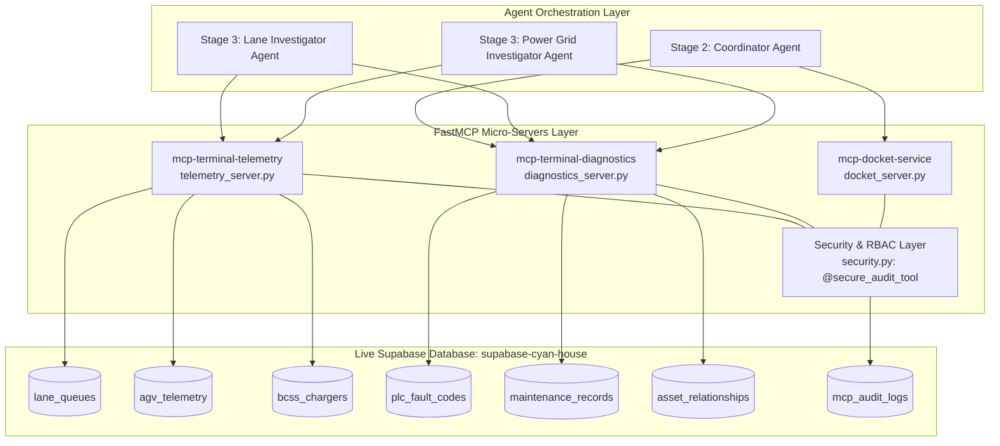

# Port Terminal MCP Architecture & Supabase Integration Guide

## 1. System Overview

This document describes the Model Context Protocol (MCP) server setup for the PSA Automated Port Terminal Incident Investigation platform. The architecture decouples real-time SCADA telemetry, PLC hardware diagnostics, incident review publishing, and enterprise security into dedicated FastMCP micro-servers backed by a live **Supabase PostgreSQL** database.



---

## 2. Supabase Table to MCP Server Mapping

Every MCP tool communicates directly with a dedicated table in Supabase. There are no static fallback mocks in production—all queries execute against live operational records with structured error reporting.

| Supabase Table | Primary Key | Description & Schema | Connected MCP Server | Connected MCP Tool(s) | Primary Consuming Agent |
| :--- | :--- | :--- | :--- | :--- | :--- |
| `lane_queues` | `lane_id` | Transfer lane blockage state, lead vehicle ID, queued vehicles array (`blocked_vehicles`), headway distance. | `mcp-terminal-telemetry`<br>([`telemetry_server.py`](file:///c:/Users/Rald999/Documents/GitHub/psa_hackathon2026/backend/mcp/telemetry_server.py)) | `get_lane_lead_agv(lane_id)` | **Lane Investigator** |
| `agv_telemetry` | `agv_id` | Real-time vehicle speed, twistlock pin sensor state (`ENGAGED`/`RELEASED`), hydraulic line pressure, error registers, battery SOC, motor temp. | `mcp-terminal-telemetry`<br>([`telemetry_server.py`](file:///c:/Users/Rald999/Documents/GitHub/psa_hackathon2026/backend/mcp/telemetry_server.py)) | `get_agv_telemetry(agv_id)` | **Lane Investigator** |
| `bcss_chargers` | `station_id` | Fast-charging & swapping station breaker state (`TRIPPED`/`NOMINAL`), DC busbar temperature, voltage, charging current, trip reason. | `mcp-terminal-telemetry`<br>([`telemetry_server.py`](file:///c:/Users/Rald999/Documents/GitHub/psa_hackathon2026/backend/mcp/telemetry_server.py)) | `get_bcss_charger_status(station_id)` | **Infrastructure Investigator** |
| `plc_fault_codes` | `fault_code` | Hexadecimal error registers decoded into failure descriptions, root cause mechanisms, and remediation actions. | `mcp-terminal-diagnostics`<br>([`diagnostics_server.py`](file:///c:/Users/Rald999/Documents/GitHub/psa_hackathon2026/backend/mcp/diagnostics_server.py)) | `decode_plc_fault_code(fault_code)`<br>`lookup_plc_fault_code(fault_code)` | **All Investigators** |
| `maintenance_records` | `record_id` | Asset service logs, historical component swaps (e.g. hydraulic actuators, DC contactors), and technician notes. | `mcp-terminal-diagnostics`<br>([`diagnostics_server.py`](file:///c:/Users/Rald999/Documents/GitHub/psa_hackathon2026/backend/mcp/diagnostics_server.py)) | `get_maintenance_history(asset_id)` | **Operations Engineers** |
| `asset_relationships` | `asset_id` | Topological impact graph mapping upstream feeder lanes/substations to downstream Quay Cranes, Berths, and AGV Sectors. | `mcp-terminal-diagnostics`<br>([`diagnostics_server.py`](file:///c:/Users/Rald999/Documents/GitHub/psa_hackathon2026/backend/mcp/diagnostics_server.py)) | `get_asset_impact(asset_id)`<br>`get_asset_relationships(asset_id)` | **Stage 2 Coordinator** |
| `mcp_audit_logs` | `audit_id` | Security audit trail recording every tool execution with user identity, parameters, duration (`execution_time_ms`), and authorization status. | **Security Layer**<br>([`security.py`](file:///c:/Users/Rald999/Documents/GitHub/psa_hackathon2026/backend/mcp/security.py)) | Handled automatically via `@secure_audit_tool` | **Security / Compliance** |

---

## 3. Server Details & Tool Specifications

### 3.1 Telemetry Server: `mcp-terminal-telemetry`
- **File:** [`backend/mcp/telemetry_server.py`](file:///c:/Users/Rald999/Documents/GitHub/psa_hackathon2026/backend/mcp/telemetry_server.py)
- **Transport:** `stdio` (FastMCP)
- **Tools:**
  - `get_lane_lead_agv(lane_id: str, actor_context: dict)`: Returns lead AGV and blockage queue for a transfer lane.
  - `get_agv_telemetry(agv_id: str, actor_context: dict)`: Returns speed, hydraulic pressure (`275.0 bar` limit), twistlock state, and active error flags.
  - `get_bcss_charger_status(station_id: str, actor_context: dict)`: Returns breaker status (`TRIPPED`/`NOMINAL`), voltage (`0.0V` / `480V`), and busbar temperature (`82.4°C`).

### 3.2 Diagnostics Server: `mcp-terminal-diagnostics`
- **File:** [`backend/mcp/diagnostics_server.py`](file:///c:/Users/Rald999/Documents/GitHub/psa_hackathon2026/backend/mcp/diagnostics_server.py)
- **Transport:** `stdio` (FastMCP)
- **Tools:**
  - `decode_plc_fault_code(fault_code: str, actor_context: dict)`: Decodes hardware error registers (e.g., `ERR_TWISTLOCK_TIMEOUT`, `OVERTEMP_THERMAL_CUTOFF`) into mechanical/electrical failure explanations.
  - `get_maintenance_history(asset_id: str, actor_context: dict)`: Retrieves chronological work orders and component history for vehicles or chargers.
  - `get_asset_impact(asset_id: str, actor_context: dict)`: Resolves downstream operational severity (e.g., Lane 7 blockage actively starving Quay Crane `QC-03` on `Berth 2`).

### 3.3 Docket Publishing Server: `mcp-docket-service`
- **File:** [`backend/mcp/docket_server.py`](file:///c:/Users/Rald999/Documents/GitHub/psa_hackathon2026/backend/mcp/docket_server.py)
- **Transport:** `stdio` (FastMCP)
- **Tools:**
  - `submit_incident_docket(incidents: list[dict], actor_context: dict)`: Compiles synthesized multi-agent findings, root causes, evidence metrics, and operator recommendations into a unified review dossier. Generates a unique tracking ID (e.g. `DOCKET-20260825-XXXXXX`).

---

## 4. Enterprise Security & Role-Based Access Control (RBAC)

All MCP tools are wrapped with the `@secure_audit_tool` decorator defined in [`backend/mcp/security.py`](file:///c:/Users/Rald999/Documents/GitHub/psa_hackathon2026/backend/mcp/security.py).

### RBAC Permissions Matrix

| User / Agent Role | Permitted MCP Tools | Disallowed Tools | Typical Actor |
| :--- | :--- | :--- | :--- |
| `AGENT_INVESTIGATOR` | `get_lane_lead_agv`, `get_agv_telemetry`, `get_bcss_charger_status`, `decode_plc_fault_code` | `get_maintenance_history`, `submit_incident_docket` | Domain Investigator Sub-Agents |
| `LANE_OPERATIONS_ENGINEER` | All telemetry & diagnostic tools (`get_lane_lead_agv`, `get_agv_telemetry`, `get_bcss_charger_status`, `decode_plc_fault_code`, `get_maintenance_history`, `get_asset_impact`) | `submit_incident_docket` | Human Terminal Engineers |
| `SYSTEM_COORDINATOR` | **All tools** (telemetry, diagnostics, topological impact, and docket submission) | None | Coordinator LLM Agent & Shift Supervisors |
| `RESTRICTED_VIEWER` | `get_lane_lead_agv`, `get_bcss_charger_status` | Deep telemetry, PLC error codes, maintenance logs, and docket publishing | Guest dashboards / Monitoring displays |

### Audit Logging Lifecycle
Every tool execution automatically logs to `mcp_audit_logs`:
1. **Timestamp:** High-precision clock time (`TIMESTAMPTZ`).
2. **Actor Credentials:** `user_id`, `user_email`, `user_role`, `client_ip`.
3. **Execution Time:** Measured in milliseconds (`execution_time_ms = (end_time - start_time) * 1000`).
4. **Status:** `SUCCESS` for authorized executions; `UNAUTHORIZED` with `PERMISSION_DENIED` payload for unauthorized requests.

---

## 5. File Structure Reference

```
backend/
├── .env                              # SUPABASE_URL, SUPABASE_KEY, OPENAI_API_KEY
├── database_schema.md                # Full PostgreSQL table documentation
└── mcp/
    ├── supabase_client.py            # Singleton Supabase database client
    ├── security.py                   # RBAC matrix, AuditLogEntry model, @secure_audit_tool
    ├── telemetry_server.py           # mcp-terminal-telemetry FastMCP server
    ├── diagnostics_server.py         # mcp-terminal-diagnostics FastMCP server
    ├── docket_server.py              # mcp-docket-service FastMCP server
    ├── mock_data.py                  # Stage 1 deterministic clustering rules
    ├── test_mcp_servers.py           # Automated unit test suite (RBAC + DB lookups)
    └── test_with_openai.py           # End-to-end multi-agent test using OpenAI function calling
```

---

## 6. How to Run & Verify

```powershell
# 1. Run Unit Tests (RBAC matrix + Live Supabase queries)
& "backend/venv/Scripts/python.exe" backend/mcp/test_mcp_servers.py

# 2. Run Autonomous End-to-End OpenAI Agent Test
& "backend/venv/Scripts/python.exe" backend/mcp/test_with_openai.py

# 3. Start Telemetry Server independently over stdio
& "backend/venv/Scripts/python.exe" backend/mcp/telemetry_server.py
```
