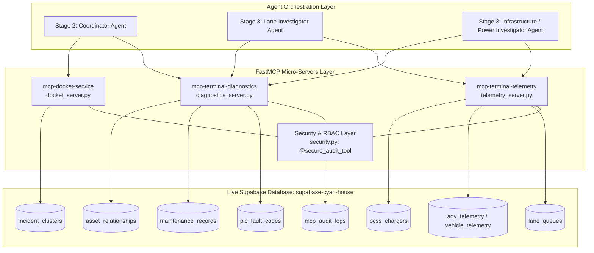

# PSA Port Terminal: MCP Architecture & Supabase Integration Guide
**Stage 1 → Stage 2 Data Contract (Schema Version 1.1.0)**

## 1. System Overview

This document provides a comprehensive overview of the Model Context Protocol (MCP) server setup for the PSA Automated Port Terminal Incident Investigation platform. The architecture decouples real-time SCADA telemetry, PLC hardware diagnostics, incident docket publishing, and enterprise role-based security into dedicated FastMCP micro-servers connected directly to a live **Supabase PostgreSQL** database (`supabase-cyan-house`).

The database and MCP layers strictly adhere to the **Stage 1 → Stage 2 Data Contract (`schemaVersion 1.1.0`)**, standardizing on **Navis N4 Port TOS Terminology** (Automated Transporter Trucks `ATT` instead of generic `AGV`, Work Assignments `WA`/`WI` lifecycle states) and **VDA5050 kinematic sensor standards**.



---

## 2. Supabase Table to MCP Server Mapping

Every MCP tool queries live tables in Supabase without in-memory mocks. The schema incorporates the **Navis N4 Work Assignment taxonomy** and **VDA5050 fields**.

| Supabase Table | Primary Key | Key Schema Fields (Contract 1.1.0) | Connected MCP Server | Connected MCP Tool(s) | Consuming Agent Role |
| :--- | :--- | :--- | :--- | :--- | :--- |
| `lane_queues` | `lane_id` | `lane_id`, `lead_vehicle_id` (ATT-142), `blocked_vehicles` (JSONB), `status`, `headway_distance_m`. | `mcp-terminal-telemetry`<br>([`telemetry_server.py`](file:///c:/Users/Rald999/Documents/GitHub/psa_hackathon2026/backend/mcp/telemetry_server.py)) | `get_lane_lead_agv(lane_id)` | **Lane Investigator** |
| `agv_telemetry` | `vehicle_id` | `vehicle_id` (e.g. `ATT-142`), `wa_id` (N4 Work Assignment ID), `wi_status` (`PENDING_REJECTION`/`IN_PROGRESS`), `load_state` (`LOADED`/`EMPTY`), `driving_state` (`STOPPED`/`DRIVING`), `protective_field_violation` (BOOLEAN), `twistlock_sensor`, `twistlock_command`, `hydraulic_pressure_bar` (275 bar), `error_register` (`SPREADER_LOCK_FAULT`). | `mcp-terminal-telemetry`<br>([`telemetry_server.py`](file:///c:/Users/Rald999/Documents/GitHub/psa_hackathon2026/backend/mcp/telemetry_server.py)) | `get_agv_telemetry(vehicle_id)`<br>`get_vehicle_telemetry(vehicle_id)` | **Lane Investigator** |
| `bcss_chargers` | `station_id` | `station_id`, `breaker_state` (`TRIPPED`/`NOMINAL`), `bus_temperature_c` (82.4°C), `voltage_v` (0.0V), `current_a`, `trip_reason` (`OVERTEMP_THERMAL_CUTOFF`). | `mcp-terminal-telemetry`<br>([`telemetry_server.py`](file:///c:/Users/Rald999/Documents/GitHub/psa_hackathon2026/backend/mcp/telemetry_server.py)) | `get_bcss_charger_status(station_id)` | **Infrastructure Investigator** |
| `plc_fault_codes` | `fault_code` | `fault_code` (`SPREADER_LOCK_FAULT`, `BCSS_CHARGER_TRIP`, `OBSTRUCTION_DETECTED`, `LOCALIZATION_LOST`, `JUNCTION_CONTENTION`, `COMMS_TIMEOUT`, `CRANE_HANDOFF_MISMATCH`, `SAFETY_FIELD_VIOLATION`), `hex_code`, `device_type` (`ATT_ACTUATOR`, `BCSS_STATION`, `ATT_SAFETY_PLC`), `description`, `possible_causes` (JSONB), `recommended_action`. | `mcp-terminal-diagnostics`<br>([`diagnostics_server.py`](file:///c:/Users/Rald999/Documents/GitHub/psa_hackathon2026/backend/mcp/diagnostics_server.py)) | `decode_plc_fault_code(fault_code)`<br>`lookup_plc_fault_code(fault_code)` | **All Investigators** |
| `maintenance_records` | `record_id` | `record_id`, `asset_id` (e.g. `ATT-142`, `BCSS-02`), `timestamp`, `event_type` (`REPAIR`, `INSPECTION`), `description`, `technician`. | `mcp-terminal-diagnostics`<br>([`diagnostics_server.py`](file:///c:/Users/Rald999/Documents/GitHub/psa_hackathon2026/backend/mcp/diagnostics_server.py)) | `get_maintenance_history(asset_id)` | **Operations Engineers** |
| `asset_relationships` | `asset_id` | `asset_id`, `asset_type`, `upstream_dependencies` (JSONB), `downstream_impact` (JSONB), `operational_impact_summary`. | `mcp-terminal-diagnostics`<br>([`diagnostics_server.py`](file:///c:/Users/Rald999/Documents/GitHub/psa_hackathon2026/backend/mcp/diagnostics_server.py)) | `get_asset_impact(asset_id)`<br>`get_asset_relationships(asset_id)` | **Stage 2 Coordinator** |
| `incident_clusters` | `cluster_id` | `cluster_id` (e.g. `INC-2026-0824-0007`), `name`, `primary_location`, `assigned_agent`, `raw_alert_ids` (JSONB), `schema_version` (`1.1.0`), `suggested_priority` (JSONB), `clustering_metadata` (JSONB), `participating_vehicles` (JSONB), `evidence_refs` (JSONB). | **Stage 1 → Stage 2 Contract Handoff** | Stage 1 Clustering & Handoff Pipeline | **Stage 2 Coordinator** |
| `mcp_audit_logs` | `audit_id` | `audit_id`, `timestamp`, `user_id`, `user_email`, `user_role`, `server_name`, `tool_name`, `parameters` (JSONB), `execution_time_ms`, `status` (`SUCCESS`/`UNAUTHORIZED`), `client_ip`. | **Security Layer**<br>([`security.py`](file:///c:/Users/Rald999/Documents/GitHub/psa_hackathon2026/backend/mcp/security.py)) | Automated via `@secure_audit_tool` | **Security & Audit Compliance** |

---

## 3. Navis N4 & VDA5050 Standard Updates

### 3.1 ATT Vehicle Notation
- Vehicles in transport lanes are denoted as **`ATT-<ID>`** (e.g., `ATT-142` lead vehicle, `ATT-089` trailing vehicle, `ATT-112`, `ATT-055`, `ATT-201`).
- The `agv_telemetry` table has been upgraded with primary key `vehicle_id` and backward-compatible alias fields in MCP tool return payloads.

### 3.2 Task & Work Assignment Lifecycle (`WA` / `WI`)
- `wa_id`: Unique Navis N4 Work Assignment identifier (e.g., `WA-88214`).
- `wi_status`: Work Instruction lifecycle status (`IN_PROGRESS`, `PENDING_REJECTION`, `BYPASSED`, `SUSPENDED`).
- `load_state`: Physical container load state (`LOADED`, `EMPTY`).
- `driving_state`: Kinematic movement state (`STOPPED`, `DRIVING`, `WAITING`).
- `protective_field_violation`: Boolean flag indicating ISO 3691-4 safety field interruptions.

### 3.3 Navis N4 Fault Code Taxonomy in `plc_fault_codes`
1. `SPREADER_LOCK_FAULT` (`0x7E1`): Spreader twistlock pin jam on container corner casting under 275 bar relief pressure.
2. `BCSS_CHARGER_TRIP` (`0x9B4`): High-voltage charging station protective breaker trip (82.4°C busbar cutoff).
3. `OBSTRUCTION_DETECTED` (`0x3A2`): Foreign object or debris detected in active travel lane.
4. `LOCALIZATION_LOST` (`0x2F1`): Vehicle lost transponder / magnetic grid guidance tracking.
5. `JUNCTION_CONTENTION` (`0x4C3`): Multi-vehicle deadlock / right-of-way conflict at lane intersection.
6. `COMMS_TIMEOUT` (`0x105`): Heartbeat missed across wireless mesh network.
7. `CRANE_HANDOFF_MISMATCH` (`0x6D8`): Vehicle positioned at transfer point but Quay Crane not aligned.
8. `SAFETY_FIELD_VIOLATION` (`0x001`): Hard-wired functional safety zone breached (ISO 3691-4).

---

## 4. Server Specifications & Tools

### 4.1 Telemetry Server: `mcp-terminal-telemetry`
- **File:** [`backend/mcp/telemetry_server.py`](file:///c:/Users/Rald999/Documents/GitHub/psa_hackathon2026/backend/mcp/telemetry_server.py)
- **Transport:** `stdio` (FastMCP)
- **Available Tools:**
  1. `get_lane_lead_agv(lane_id: str, actor_context: dict)`: Returns `lead_vehicle_id` (e.g., `ATT-142`), queue list, and blockage status.
  2. `get_agv_telemetry(vehicle_id: str, actor_context: dict)`: Returns VDA5050 states, `wa_id`, `wi_status`, speed, hydraulic pressure, and error register.
  3. `get_vehicle_telemetry(vehicle_id: str, actor_context: dict)`: Explicit Navis N4 alias for `get_agv_telemetry`.
  4. `get_bcss_charger_status(station_id: str, actor_context: dict)`: Queries charging station voltage, busbar temperature (`82.4°C`), and breaker state.

### 4.2 Diagnostics Server: `mcp-terminal-diagnostics`
- **File:** [`backend/mcp/diagnostics_server.py`](file:///c:/Users/Rald999/Documents/GitHub/psa_hackathon2026/backend/mcp/diagnostics_server.py)
- **Transport:** `stdio` (FastMCP)
- **Available Tools:**
  1. `decode_plc_fault_code(fault_code: str, actor_context: dict)`: Translates N4 fault codes (`SPREADER_LOCK_FAULT`, `BCSS_CHARGER_TRIP`, etc.) into diagnostic causes and recovery actions.
  2. `get_maintenance_history(asset_id: str, actor_context: dict)`: Returns historical service logs (e.g., forward twistlock line replacement on `ATT-142`).
  3. `get_asset_impact(asset_id: str, actor_context: dict)`: Resolves downstream operational severity (e.g., `LANE-7` blockage starving Quay Crane `QC-03` on `Berth 2`).

### 4.3 Docket Publishing Server: `mcp-docket-service`
- **File:** [`backend/mcp/docket_server.py`](file:///c:/Users/Rald999/Documents/GitHub/psa_hackathon2026/backend/mcp/docket_server.py)
- **Transport:** `stdio` (FastMCP)
- **Available Tools:**
  1. `submit_incident_docket(incidents: list[dict], actor_context: dict)`: Compiles synthesized incident findings, telemetry proof, and operator recommendations into a review docket with a timestamped ID (`DOCKET-YYYYMMDD-XXXXXX`).

---

## 5. Enterprise Security & Role-Based Access Control (RBAC)

All MCP tools are protected by the `@secure_audit_tool` decorator in [`backend/mcp/security.py`](file:///c:/Users/Rald999/Documents/GitHub/psa_hackathon2026/backend/mcp/security.py).

### RBAC Permissions Matrix

| User / Agent Role | Permitted MCP Tools | Disallowed Tools | Typical Role Assignment |
| :--- | :--- | :--- | :--- |
| `AGENT_INVESTIGATOR` | `get_lane_lead_agv`, `get_agv_telemetry`, `get_vehicle_telemetry`, `get_bcss_charger_status`, `decode_plc_fault_code`, `lookup_plc_fault_code` | `get_maintenance_history`, `submit_incident_docket` | Domain Investigator Sub-Agents |
| `LANE_OPERATIONS_ENGINEER` | All telemetry & diagnostic tools (`get_lane_lead_agv`, `get_agv_telemetry`, `get_bcss_charger_status`, `decode_plc_fault_code`, `get_maintenance_history`, `get_asset_impact`) | `submit_incident_docket` | Terminal Field Engineers |
| `SYSTEM_COORDINATOR` | **All tools** (telemetry, diagnostics, topological impact, and docket publishing) | None | Coordinator LLM Agent & Shift Supervisors |
| `RESTRICTED_VIEWER` | `get_lane_lead_agv`, `get_bcss_charger_status` | Deep telemetry, PLC error codes, maintenance logs, and docket publishing | Guest dashboards / Monitoring displays |

### Automated Audit Trail (`mcp_audit_logs`)
Every tool execution automatically logs to the `mcp_audit_logs` table in Supabase:
- **Timestamp:** High-precision clock time (`TIMESTAMPTZ`).
- **Actor Metadata:** `user_id`, `user_email`, `user_role`, `client_ip`.
- **Execution Time:** Measured with millisecond precision (`execution_time_ms = (end_time - start_time) * 1000`).
- **Status:** `SUCCESS` for authorized calls; `UNAUTHORIZED` with `PERMISSION_DENIED` for blocked attempts.

---

## 6. How to Run & Verify

```powershell
# 1. Run Automated Unit Tests (RBAC Matrix + Live Supabase Queries)
& "backend/venv/Scripts/python.exe" backend/mcp/test_mcp_servers.py

# 2. Run Autonomous End-to-End OpenAI Agent Test
& "backend/venv/Scripts/python.exe" backend/mcp/test_with_openai.py

# 3. Start Telemetry Server independently over stdio
& "backend/venv/Scripts/python.exe" backend/mcp/telemetry_server.py
```
