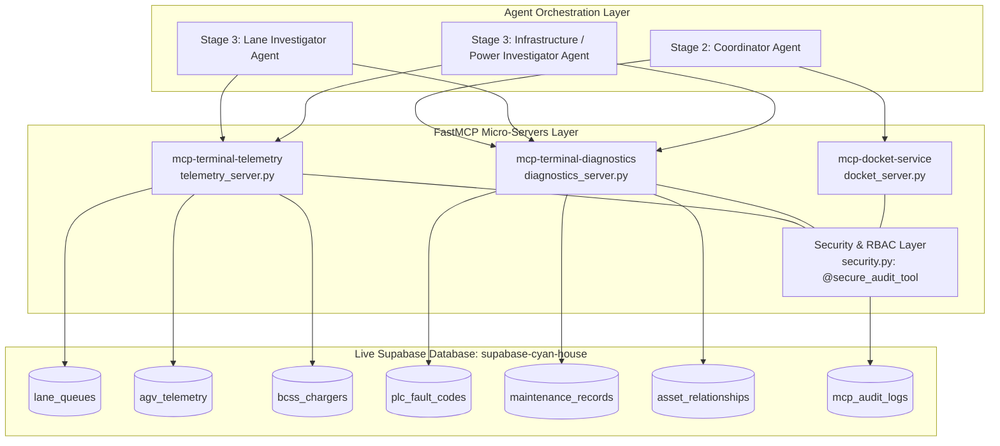

# PSA Port Terminal: MCP Architecture & Supabase Integration Guide

## 1. System Overview

This document provides a comprehensive overview of the Model Context Protocol (MCP) server setup for the PSA Automated Port Terminal Incident Investigation platform. The architecture decouples real-time SCADA telemetry, PLC hardware diagnostics, incident docket publishing, and enterprise role-based security into dedicated FastMCP micro-servers connected directly to a live **Supabase PostgreSQL** database (`supabase-cyan-house`).



---

## 2. Supabase Table to MCP Server Mapping

Every MCP tool queries a live table in Supabase. In-memory fallbacks have been removed in favor of strict, live database lookups with structured error reporting.

| Supabase Table | Primary Key | Description & Key Schema Fields | Connected MCP Server | Connected MCP Tool(s) | Primary Consuming Agent |
| :--- | :--- | :--- | :--- | :--- | :--- |
| `lane_queues` | `lane_id` | Transfer lane blockage state, lead vehicle ID, queued vehicles array (`blocked_vehicles`), headway distance. | `mcp-terminal-telemetry`<br>([`telemetry_server.py`](file:///c:/Users/Rald999/Documents/GitHub/psa_hackathon2026/backend/mcp/telemetry_server.py)) | `get_lane_lead_agv(lane_id)` | **Lane Investigator** |
| `agv_telemetry` | `agv_id` | Real-time vehicle speed, twistlock pin sensor state (`ENGAGED`/`RELEASED`), hydraulic line pressure, error registers, battery SOC, motor temp. | `mcp-terminal-telemetry`<br>([`telemetry_server.py`](file:///c:/Users/Rald999/Documents/GitHub/psa_hackathon2026/backend/mcp/telemetry_server.py)) | `get_agv_telemetry(agv_id)` | **Lane Investigator** |
| `bcss_chargers` | `station_id` | Fast-charging & swapping station breaker state (`TRIPPED`/`NOMINAL`), DC busbar temperature, voltage, charging current, trip reason. | `mcp-terminal-telemetry`<br>([`telemetry_server.py`](file:///c:/Users/Rald999/Documents/GitHub/psa_hackathon2026/backend/mcp/telemetry_server.py)) | `get_bcss_charger_status(station_id)` | **Infrastructure Investigator** |
| `plc_fault_codes` | `fault_code` | Hexadecimal error registers decoded into failure descriptions, root cause mechanisms, and remediation actions. | `mcp-terminal-diagnostics`<br>([`diagnostics_server.py`](file:///c:/Users/Rald999/Documents/GitHub/psa_hackathon2026/backend/mcp/diagnostics_server.py)) | `decode_plc_fault_code(fault_code)`<br>`lookup_plc_fault_code(fault_code)` | **All Investigators** |
| `maintenance_records` | `record_id` | Asset service logs, historical component swaps (e.g., hydraulic lines, contactors), and technician notes. | `mcp-terminal-diagnostics`<br>([`diagnostics_server.py`](file:///c:/Users/Rald999/Documents/GitHub/psa_hackathon2026/backend/mcp/diagnostics_server.py)) | `get_maintenance_history(asset_id)` | **Operations Engineers** |
| `asset_relationships` | `asset_id` | Topological impact graph mapping upstream feeder lanes/substations to downstream Quay Cranes, Berths, and AGV Sectors. | `mcp-terminal-diagnostics`<br>([`diagnostics_server.py`](file:///c:/Users/Rald999/Documents/GitHub/psa_hackathon2026/backend/mcp/diagnostics_server.py)) | `get_asset_impact(asset_id)`<br>`get_asset_relationships(asset_id)` | **Stage 2 Coordinator** |
| `mcp_audit_logs` | `audit_id` | Security audit trail recording every tool execution with user identity, parameters, duration (`execution_time_ms`), and authorization status. | **Security Layer**<br>([`security.py`](file:///c:/Users/Rald999/Documents/GitHub/psa_hackathon2026/backend/mcp/security.py)) | Automated via `@secure_audit_tool` | **Security / Compliance** |

---

## 3. Server Specifications & Tools

### 3.1 Telemetry Server: `mcp-terminal-telemetry`
- **File:** [`backend/mcp/telemetry_server.py`](file:///c:/Users/Rald999/Documents/GitHub/psa_hackathon2026/backend/mcp/telemetry_server.py)
- **Transport:** `stdio` (FastMCP)
- **Available Tools:**
  1. `get_lane_lead_agv(lane_id: str, actor_context: dict)`: Resolves transfer lane queue order and finds blocking vehicle.
  2. `get_agv_telemetry(agv_id: str, actor_context: dict)`: Retrieves twistlock pin state, hydraulic line pressure, speed, and error registers.
  3. `get_bcss_charger_status(station_id: str, actor_context: dict)`: Queries charging station voltage, busbar temperature, and breaker trip status.

### 3.2 Diagnostics Server: `mcp-terminal-diagnostics`
- **File:** [`backend/mcp/diagnostics_server.py`](file:///c:/Users/Rald999/Documents/GitHub/psa_hackathon2026/backend/mcp/diagnostics_server.py)
- **Transport:** `stdio` (FastMCP)
- **Available Tools:**
  1. `decode_plc_fault_code(fault_code: str, actor_context: dict)`: Translates raw PLC error codes (e.g., `ERR_TWISTLOCK_TIMEOUT`, `OVERTEMP_THERMAL_CUTOFF`) into failure mechanisms and recommended actions.
  2. `get_maintenance_history(asset_id: str, actor_context: dict)`: Returns historical maintenance records and parts replacements for a vehicle or station.
  3. `get_asset_impact(asset_id: str, actor_context: dict)`: Retrieves upstream dependencies and downstream operational impact (e.g., assessing whether a lane jam starves Quay Crane QC-03 on Berth 2).

### 3.3 Docket Publishing Server: `mcp-docket-service`
- **File:** [`backend/mcp/docket_server.py`](file:///c:/Users/Rald999/Documents/GitHub/psa_hackathon2026/backend/mcp/docket_server.py)
- **Transport:** `stdio` (FastMCP)
- **Available Tools:**
  1. `submit_incident_docket(incidents: list[dict], actor_context: dict)`: Validates and publishes multi-agent findings, telemetry proof, and operator recommendations into a unified review docket with a timestamped tracking ID.

---

## 4. Enterprise Security & Role-Based Access Control (RBAC)

All MCP tools are protected by the `@secure_audit_tool` decorator in [`backend/mcp/security.py`](file:///c:/Users/Rald999/Documents/GitHub/psa_hackathon2026/backend/mcp/security.py).

### RBAC Permissions Matrix

| User / Agent Role | Permitted MCP Tools | Disallowed Tools | Typical Role Assignment |
| :--- | :--- | :--- | :--- |
| `AGENT_INVESTIGATOR` | `get_lane_lead_agv`, `get_agv_telemetry`, `get_bcss_charger_status`, `decode_plc_fault_code` | `get_maintenance_history`, `submit_incident_docket` | Domain Investigator Sub-Agents |
| `LANE_OPERATIONS_ENGINEER` | All telemetry & diagnostic tools (`get_lane_lead_agv`, `get_agv_telemetry`, `get_bcss_charger_status`, `decode_plc_fault_code`, `get_maintenance_history`, `get_asset_impact`) | `submit_incident_docket` | Terminal Field Engineers |
| `SYSTEM_COORDINATOR` | **All tools** (telemetry, diagnostics, topological impact, and docket publishing) | None | Coordinator LLM Agent & Shift Supervisors |
| `RESTRICTED_VIEWER` | `get_lane_lead_agv`, `get_bcss_charger_status` | Deep telemetry, PLC error codes, maintenance logs, and docket publishing | Guest dashboards / Monitoring displays |

### Audit Logging Lifecycle
Every tool execution automatically logs to the `mcp_audit_logs` table in Supabase:
- **Timestamp:** High-precision clock time (`TIMESTAMPTZ`).
- **Actor Metadata:** `user_id`, `user_email`, `user_role`, `client_ip`.
- **Execution Time:** Measured with millisecond precision (`execution_time_ms = (end_time - start_time) * 1000`).
- **Status:** `SUCCESS` for authorized executions; `UNAUTHORIZED` with `PERMISSION_DENIED` for blocked attempts.

---

## 5. File Structure Reference

```
backend/
├── .env                              # SUPABASE_URL, SUPABASE_KEY, OPENAI_API_KEY
├── database_schema.md                # Full PostgreSQL table documentation
└── mcp/
    ├── supabase_client.py            # Singleton Supabase database client
    ├── security.py                   # RBAC matrix, AuditLogEntry model, @secure_audit_tool
    ├── telemetry_server.py           # mcp-terminal-telemetry FastMCP server
    ├── diagnostics_server.py         # mcp-terminal-diagnostics FastMCP server
    ├── docket_server.py              # mcp-docket-service FastMCP server
    ├── mock_data.py                  # Stage 1 deterministic clustering rules
    ├── test_mcp_servers.py           # Automated unit test suite (RBAC + DB lookups)
    └── mcp_setup_and_supabase_mapping.md # Architecture & Supabase mapping guide
```

---

## 6. How to Run & Verify

```powershell
# 1. Run Automated Unit Tests (RBAC Matrix + Live Supabase Queries)
& "backend/venv/Scripts/python.exe" backend/mcp/test_mcp_servers.py

# 2. Start Telemetry Server independently over stdio
& "backend/venv/Scripts/python.exe" backend/mcp/telemetry_server.py

# 3. Start Diagnostics Server independently over stdio
& "backend/venv/Scripts/python.exe" backend/mcp/diagnostics_server.py

# 4. Start Docket Service independently over stdio
& "backend/venv/Scripts/python.exe" backend/mcp/docket_server.py
```
